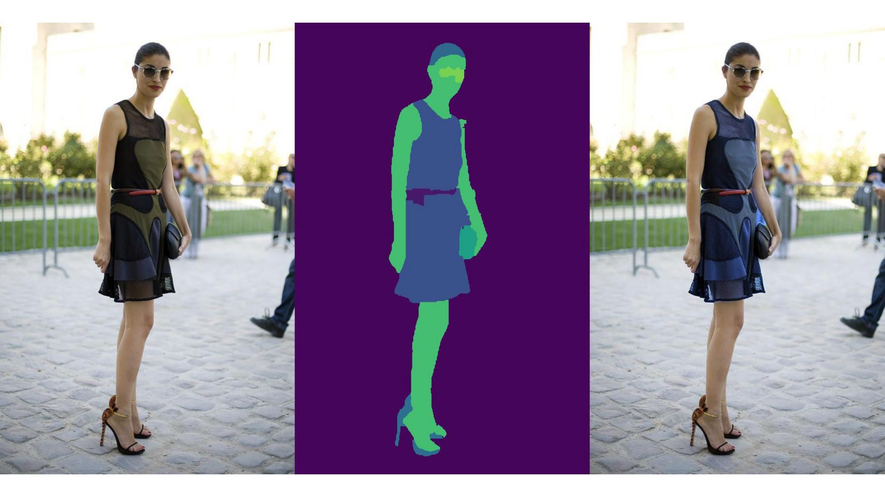

# Deep-Fake-Fashion

 An AI based tool designed to generate various colors and designs of a clothing apparel using a single image

## Example

  
  

Original vs. Generated Image

## Detailed Working

## Preservation of minute details

## Other Examples

